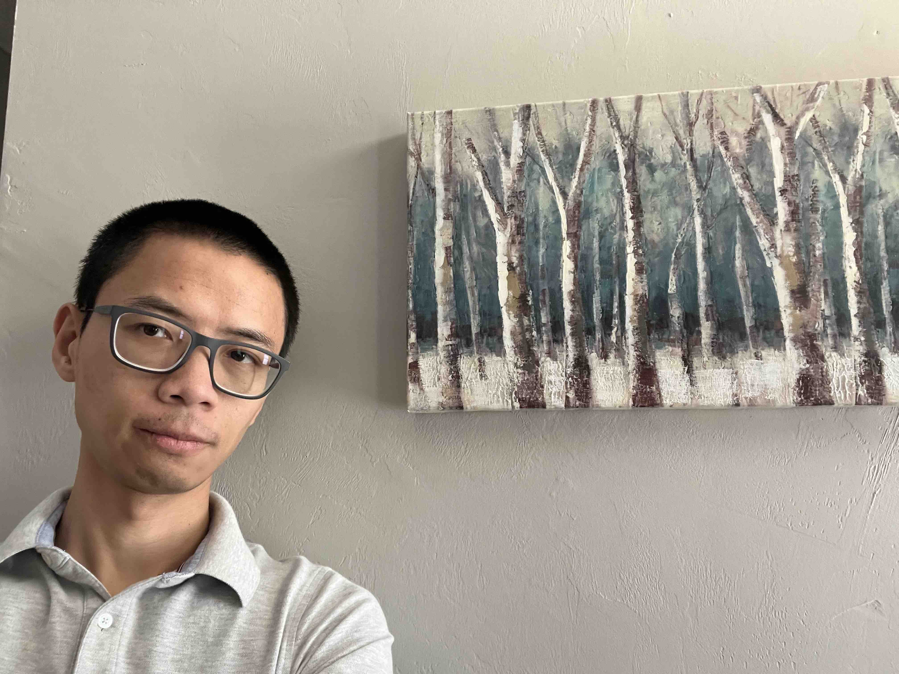

#### Hello, thanks for checking out my website.

I'm Leo Duan. I'm a statistician and an assistant professor working at University of Florida since 2018. Prior to that, I obtained my PhD in Mathematics at University of Cincinnati in 2015 under the supervision of Rhonda Szczesniak and Xia Wang, worked a year as a data scientist in the tech sector, and spent two years as a postdoc working with David Dunson at Johns Hopkins and Duke University.

# Research Interests
My recent research focuses on the following areas (with some representative works):

1.	**Optimization & Bayes**:

    *   Maoran Xu and Leo L. Duan. Bayesian Inference with the l1-ball Prior: Solving Combinatorial Problems with Exact Zeros. JRSSB, 2023.
    *   Maoran Xu, Hua Zhou, Yujie Hu and Leo L. Duan. Bayesian Inference using the Proximal Mapping: Uncertainty Quantification under Varying Dimensionality.  JASA, 2023.
    *   Leo L. Duan.  High-Accuracy Posterior Approximation via Random Transport. JASA, 2021.
    *   Leo L. Duan. Latent Simplex Position Model. JMLR, 2020.
    *   Leo L. Duan, Alex Young, Akihiko Nishimura, and David B. Dunson. Bayesian Constraint Relaxation. Biometrika 2019.
    *   Leo L. Duan, James E. Johndrow, and David B. Dunson. Scaling up Data Augmentation MCMC via Calibration. JMLR, 2018.

2.	**Graph, Clustering & Bayes**:
    *   Leo L. Duan and Arkaprava Roy.  Spectral Clustering, Spanning Forest, and Bayesian Forest Process. JASA, 2023. (in press)
    *   Cheng Zeng, Jeffrey Miller and Leo L. Duan. Quasi-Bernoulli Stick-breaking: Infinite Mixture with Cluster Consistency. JMLR, 2023
    *   Leo L. Duan and David B. Dunson. Bayesian Spanning Tree: Estimating the Backbone of the Dependence Graph. (revision at JMLR 2023)  https://arxiv.org/abs/2106.16120
    *   Zeyu Yuwen, George Michailidis, Zhengwu Zhang and Leo L. Duan.  Bayesian Vector Autoregression using the Tree Rank Prior.  (revision at JMLR 2023)  https://arxiv.org/abs/2204.01573
    *   Leo L. Duan, George Michailidis and Mingzhou Ding. Spiked Laplacian Graph. JMLR, 2022. http://arxiv.org/abs/1910.02471
    *   Leo L. Duan and David B. Dunson. Bayesian Distance Clustering. JMLR, 2021.

# Selected Fundings and Awards

2023-2026 NSF Funding Award (PI): Risk mitigation for human movement dynamics under hurricane threats. With Yujie Hu and George Michailidis.

2022 UF CLAS Faculty Travel Award

2022-2023 UFII SEED Funding Award

2021 UF Statistics Faculty Award for the Supervised Student (Maoran Xu)

2018 NeurIPS Bayesian Non-parametrics Award

2015 ASA Paper Competition Award in Section on Bayesian Statistical Science

2014 Woodside Foundation Award for Contribution in Biostatistics and Epidemiology Research

# Recent and Upcoming Talks:

May 2023, Seminar Talk at Harvard University, Department of Biostatistics 

January 2023, Seminar Talk at Texas A&M University, Department of Statistics

October 2022, International Conference on Bayesian Nonparametrics in Puerto Varas, Chile

# Current and Former PhD students
Eleni Dilma

Cheng Zeng

Yu Zheng

Maoran Xu (Graduated 2022)

# Contact Info
PhD student interested in working with us? Send me an email!
_li dot duan at ufl dot edu_

# Academic Services
####  Associate Editor of
Data Science in Science

#### Reviewer for
AISTATS, Bayesian Analysis, Bernoulli, Biometrics, Journal of Machine Learning Research, Journal of the American Statistical Association, Statistics in Medicine, Statistical Sinica, NeurIPS

# Publications

For the up-to-date list of publications and pre-prints, see https://scholar.google.com/citations?user=4i5UQLAAAAAJ&hl=en

