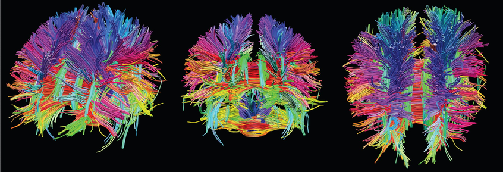
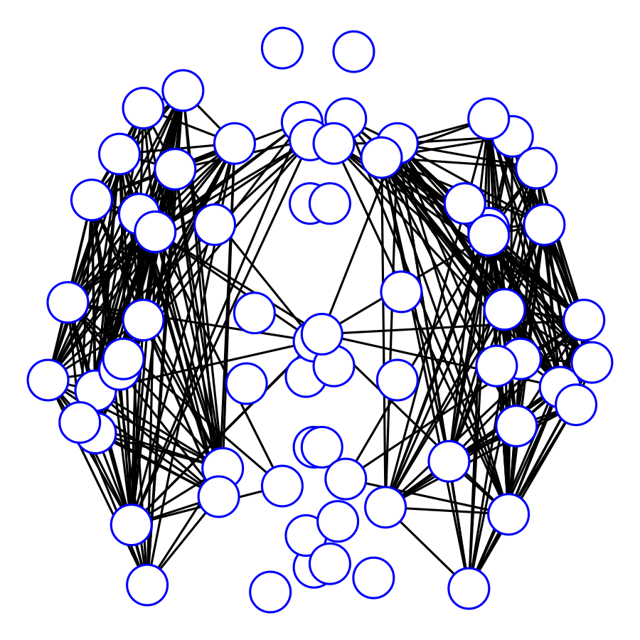

# Leo Li Duan

I'm a statistician interested in **Robust Bayes** and **Pseudo-Likellihood**.  The current push is to use pseudo-likelihood to build more flexible and robust models for complex data arising from machine learning, biomedical research and neuroscience.

I work as an Assistant Professor in the Department of Statistics at University of Florida. Previously I was a postdoc associate in Duke University, working with Prof. David Dunson on Bayesian modeling for complex data. I obtained my PhD from Department of Mathematics at University of Cincinnati in 2015, studying non-parametric Bayes and working with Profs. Rhonda Szczesniak and Xia Wang.

Email:
_***li dot duan at ufl dot edu***_

### Course Links

Spring 2019
[Link to STA4321 / STA5325](./stat4321/start.html).

Fall 2018
[Link to STA4322 / STA5328](./stat4322/start.html).

### Research Interests

#### Bayes Pseudo-Likelihood

Conventionally, Bayesian inference requires a correctly specified model, describing the full generating process for the data. This can create problems for modern machine learning tasks: i. Modeling everything has a high modeling and computing cost; ii. Usually the data have some deviation from the model assumption, which can lead to (often unbounded) deterioration of performance.

I'm interested in tackling these problems through the new framework called  "Bayesian Pseudo-Likelihood". This may involve:

1. Replacing the complicated prior/likelihood with a simple approximate (but having proper density). 
2. Assigning a probabilistic model on some *transform* of  the source data, such as some robust summary statistics, or a lower-dimensional representation.

The "pseudo-nesss" got its name as these probabilitistic models may not correspond exactly with the unobserved "truth", but it substantially improves the overall model robustness and reduces the model complexity.

#### Awards
- BNP@NeurIPS Award, Montreal 2018
- Objective Bayes Workshop Travel Award, Austin 2017
- Student Paper Award in Section on Bayesian Statistics Science, Joint Statistical Meetings, Seattle 2015

#### Publications

##### Statistical Methodology:
*   Leo L. Duan. Transport Monte Carlo 2019+. http://arxiv.org/abs/1907.10448
*   Yue Bai and Leo L. Duan. Tuning-Free Disentanglement via Projected Variational Autoencoder  2019+. https://arxiv.org/abs/1906.11732
*   Leo L. Duan. Latent Simplex Position Model: High Dimensional Multi-view Clustering with Uncertainty Quantification. 2019+. https://arxiv.org/abs/1903.09029
*   Leo L. Duan and David B. Dunson. Bayesian Distance Clustering. 2019+. https://arxiv.org/abs/1810.08537
*   Leo L. Duan, Alex Young, Akihiko Nishimura, and David B. Dunson. Bayesian Constraint Relaxation. Biometrika 2019, accepted.
*   Leo L. Duan and Jeffrey W. Miller. Distribution-based Clustering using Characteristic Function. Neural Information Processing Systems Bayesian Nonparametrics Workshop, accepted 2018.
*	Leo L. Duan, James E. Johndrow, and David B. Dunson. Scaling up Data Augmentation MCMC via Calibration. Journal of Machine Learning Research, 2018.
*   Leo L. Duan, Rhonda D. Szczesniak, and Xia Wang. Mixed-Stationary Gaussian Process for Flexible Non-Stationary Modeling of Spatial Outcomes. 2018+.
*   Leo L. Duan, Rhonda D. Szczesniak, and Xia Wang. Functional Inverted-Wishart for Bayesian Multivariate Spatial Modeling with Application to Regional Climatology Model Data. Environmetrics, accepted 2017.
*   Leo L. Duan, John P. Clancy, and Rhonda D. Szczesniak. Bayesian Ensemble Trees for Clustering and Prediction in Heterogeneous Data. Journal of Computational and Graphical Statistics, 25(3):748–761, 2016.

##### Biostatistics:

*	Otso Ovaskainen, Gleb Tikhonov, Anna Norberg, F. Guillaume Blanchet, Leo L. Duan, David B. Dunson, Tomas Roslin, and Nerea Abrego. How to Make More Out of Community Data? A Conceptual Framework and Its Implementation as Models and Software. Ecology Letters, 20(5):561–576, 2017.
*  Leo L. Duan, John P. Clancy, and Rhonda D. Szczesniak. Joint Hierarchical Gaussian Process Model with Application to forecast in Medical Monitoring. STAT 2017.
*  Judith W Dexheimer, Eric S Kirkendall, Michal Kouril, Philip A Hagedorn, Thomas Minich, Leo L. Duan, Monifa Mahdi, Rhonda D. Szczesniak, S andrew Spooner, et al. The Effects of Medication Alerts on Prescriber Response in a Pediatric Hospital. Applied Clinical Informatics, 8(2):491–501, 2016.
*  Rhonda D. Szczesniak, Dan Li, Leo L. Duan, Mekibib Altaye, Menachem Miodovnik, and Jane C Khoury. Longitudinal Patterns of Glycemic Control and Blood Pressure in Pregnant Women with Type 1 Diabetes Mellitus: Phenotypes From Functional Data Analysis. American Journal of Perinatology, 33(13):1282–1290, 2016.
*  Kavitha Kotha, Rhonda D. Szczesniak, Anjaparavanda P Naren, Matthew C Fenchel, Leo L. Duan, Gary L McPhail, and John P. Clancy. Concentration of Fractional Excretion of Nitric Oxide: A Potential Airway Biomarker of Restored Cftr Function. Journal of Cystic Fibrosis, 14(6):733–740, 2015. 
*  Rhonda D. Szczesniak, Leo L. Duan, Gary L McPhail, Barbara B. Chini, Laurie Kahill, Maurizio Macaluso, Raouf S. Amin, and John P. Clancy. Determinants for the Early Onset of Rapid FEV1 Decline in Cystic Fibrosis. Pediatric Pulmonology, 48:368, 2013.
*  Rhonda D. Szczesniak, Gary L. McPhail, Leo L. Duan, Maurizio Macaluso, Raouf S Amin, and John P. Clancy. A Semiparametric Approach to Estimate Rapid Lung Function Decline in Cystic Fibrosis. Annals of Epidemiology, 23(12):771–777, 2013.

##### Computational Physics:

*  Ji Young Lee, Leo L. Duan, Tyler M Iverson, and Ruxandra I Dima. Exploring the Role of Topological Frustration in Actin Refolding with Molecular Simulations. the Journal of Physical Chemistry B, 116(5):1677–1686, 2012.

*  Leo L. Duan, Artem Zhmurov, Valeri Barsegov, and Ruxandra I Dima. Exploring the Mechanical Stability of the C2 Domains in Human Synaptotagmin 1. the Journal of Physical Chemistry B,115(33):10133–10146, 2011.

