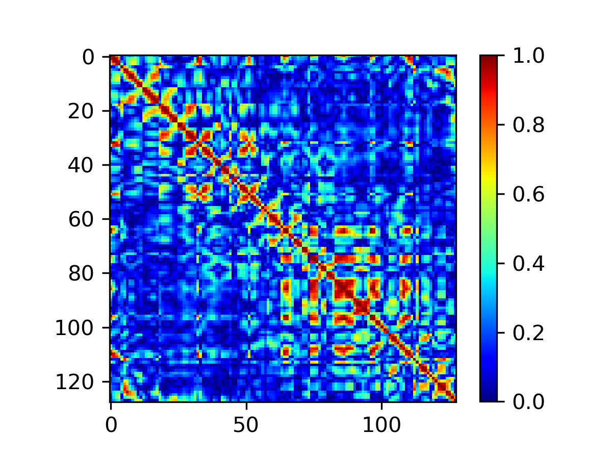
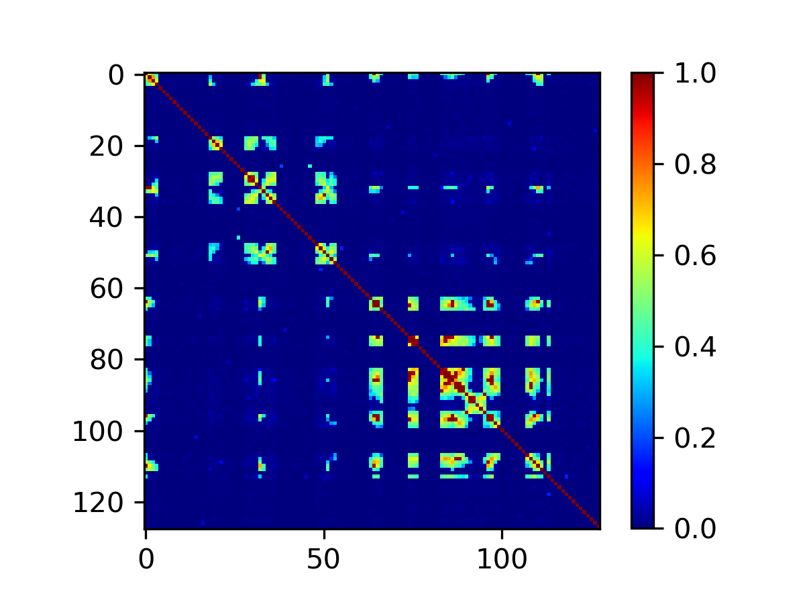
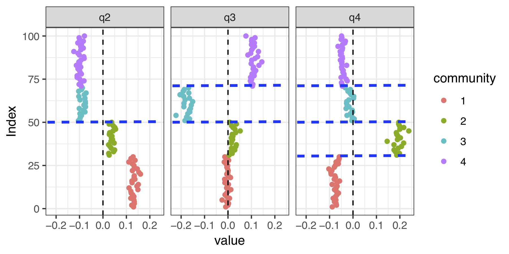
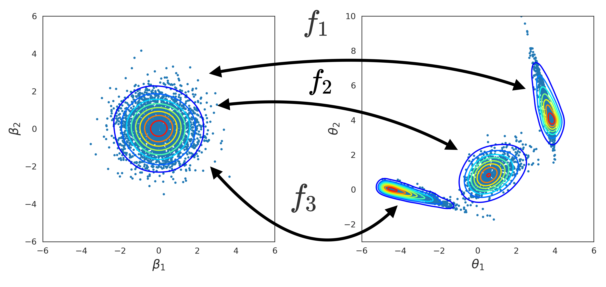

# Leo Li Duan

I'm an assistant professor & statistician working on Generalized Bayes. My current interest is to build a new set of probabilistic (a.k.a. Bayesian) models that exploit non-parametric Bayes, optimization & graph theory. The core application focus is on neuroscience.

Email:
_li dot duan at ufl dot edu_

Note: **We don't provide summer internship in our lab**. 

### Research Interests
* Network modeling

 
 

* Optimization-based approach to posterior sampling  & approximation

#### Publications
*   Cheng Zeng and Leo L. Duan. Quasi-Bernoulli Stick-breaking: Infinite Mixture with Cluster Consistency. 2020+  https://arxiv.org/abs/2008.09938
*   Maoran Xu and Leo L. Duan. L1-ball Prior: Uncertainty Quantification with Exact Zeros. 2020+  https://arxiv.org/abs/2006.01340
*   Maoran Xu and Leo L. Duan. Bayesian Multi-scale Modeling of Factor Matrix without using Partition Tree. 2020+ https://arxiv.org/abs/2002.09606
*   Leo L. Duan and David B. Dunson. Bayesian Distance Clustering. 2020+. https://arxiv.org/abs/1810.08537
*   Leo L. Duan, George Michailidis and Mingzhou Ding. Spiked Laplacian Graph. 2020+. http://arxiv.org/abs/1910.02471
*   Leo L. Duan. Transport Monte Carlo 2020+. http://arxiv.org/abs/1907.10448

*   Leo L. Duan, Alex Young, Akihiko Nishimura, and David B. Dunson. Bayesian Constraint Relaxation. Biometrika 2019.
*   Yue Bai and Leo L. Duan. Tuning-Free Disentanglement via Projected Variational Autoencoder  2019+. https://arxiv.org/abs/1906.11732
*   Leo L. Duan, James E. Johndrow, and David B. Dunson. Scaling up Data Augmentation MCMC via Calibration. Journal of Machine Learning Research, 2018.
*   Leo L. Duan. Latent Simplex Position Model. Journal of Machine Learning Research, 2020.
*   Leo L. Duan and Jeffrey W. Miller. Distribution-based Clustering using Characteristic Function. NeurIPS Bayesian Nonparametrics Workshop 2018.
*   Leo L. Duan, Rhonda D. Szczesniak, and Xia Wang. Mixed-Stationary Gaussian Process for Flexible Non-Stationary Modeling of Spatial Outcomes. 2018+.
*   Leo L. Duan, Rhonda D. Szczesniak, and Xia Wang. Functional Inverted-Wishart for Bayesian Multivariate Spatial Modeling with Application to Regional Climatology Model Data. Environmetrics, 2017.
*   Leo L. Duan, John P. Clancy, and Rhonda D. Szczesniak. Bayesian Ensemble Trees for Clustering and Prediction in Heterogeneous Data. Journal of Computational and Graphical Statistics, 25(3):748–761, 2016.
*	Otso Ovaskainen, Gleb Tikhonov, Anna Norberg, F. Guillaume Blanchet, Leo L. Duan, David B. Dunson, Tomas Roslin, and Nerea Abrego. How to Make More Out of Community Data? A Conceptual Framework and Its Implementation as Models and Software. Ecology Letters, 20(5):561–576, 2017.
*  Leo L. Duan, John P. Clancy, and Rhonda D. Szczesniak. Joint Hierarchical Gaussian Process Model with Application to forecast in Medical Monitoring. STAT 2017.
*  Judith W Dexheimer, Eric S Kirkendall, Michal Kouril, Philip A Hagedorn, Thomas Minich, Leo L. Duan, Monifa Mahdi, Rhonda D. Szczesniak, S andrew Spooner, et al. The Effects of Medication Alerts on Prescriber Response in a Pediatric Hospital. Applied Clinical Informatics, 8(2):491–501, 2016.
*  Rhonda D. Szczesniak, Dan Li, Leo L. Duan, Mekibib Altaye, Menachem Miodovnik, and Jane C Khoury. Longitudinal Patterns of Glycemic Control and Blood Pressure in Pregnant Women with Type 1 Diabetes Mellitus: Phenotypes From Functional Data Analysis. American Journal of Perinatology, 33(13):1282–1290, 2016.
*  Kavitha Kotha, Rhonda D. Szczesniak, Anjaparavanda P Naren, Matthew C Fenchel, Leo L. Duan, Gary L McPhail, and John P. Clancy. Concentration of Fractional Excretion of Nitric Oxide: A Potential Airway Biomarker of Restored Cftr Function. Journal of Cystic Fibrosis, 14(6):733–740, 2015. 
*  Rhonda D. Szczesniak, Leo L. Duan, Gary L McPhail, Barbara B. Chini, Laurie Kahill, Maurizio Macaluso, Raouf S. Amin, and John P. Clancy. Determinants for the Early Onset of Rapid FEV1 Decline in Cystic Fibrosis. Pediatric Pulmonology, 48:368, 2013.
*  Rhonda D. Szczesniak, Gary L. McPhail, Leo L. Duan, Maurizio Macaluso, Raouf S Amin, and John P. Clancy. A Semiparametric Approach to Estimate Rapid Lung Function Decline in Cystic Fibrosis. Annals of Epidemiology, 23(12):771–777, 2013.

### Course Links

Spring 2020: Convex Optimization
[Link to STA7934](./stat7934/start.html).

Fall 2019:
[Link to STA4322 / STA5328](./stat4322/start.html).

Spring 2019
[Link to STA4321 / STA5325](./stat4321/start.html).

#### Awards
- BNP@NeurIPS Award, Montreal 2018
- Objective Bayes Workshop Travel Award, Austin 2017
- Student Paper Award in Section on Bayesian Statistics Science, Joint Statistical Meetings, Seattle 2015

